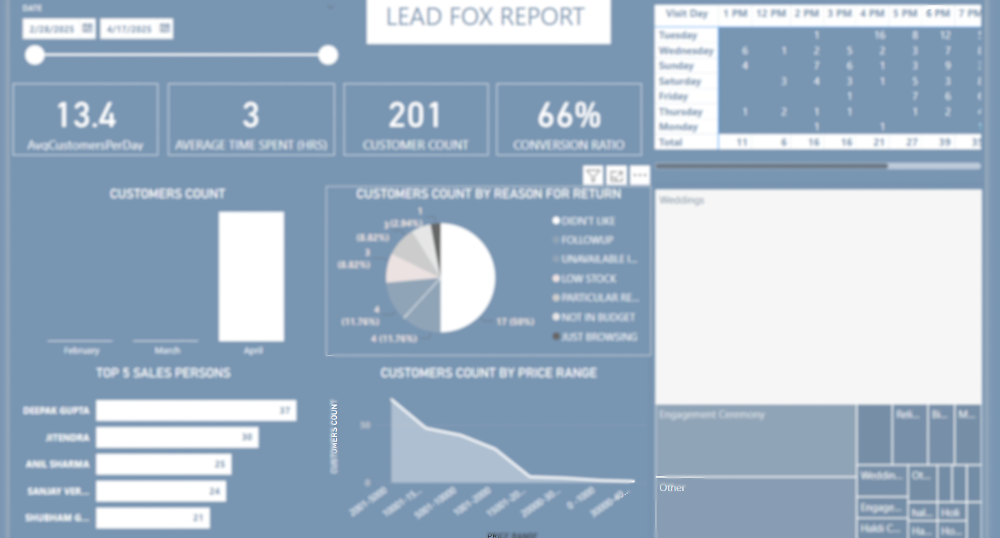

# Customer Insights Dashboard




Note: This image contains sensitive business data. For public repositories, consider using a blurred version.

## Project Overview
The primary objective of this project is to analyze the pricing, distribution, and trends of drugs across various stores using the provided dataset. By leveraging SQL, we aim to gain actionable insights into drug pricing patterns, store performance, and product availability, which can aid decision-making in the pharmaceutical industry.

## Customer Status Distribution
SALE customers dominate the interaction, reflecting a strong conversion pipeline.
Notable statuses include:
RETURN and REVISITED TO BUY – potential for post-sale engagement improvements.
NEW and EXCHANGE – active footfall from new and returning customers.

## Return Reasons Analysis

"Just Browsing" accounts for 50% of returns – signals need for stronger product engagement.

"Not in Budget" and "Particular Requirement" each represent 11.76% – opportunity to refine pricing strategy and inventory alignment.

Other reasons: Low Stock, Unavailable Items, Didn’t Like – highlight inventory and merchandising improvements needed.

## Customer Count by Price Range

Maximum customer count falls in ₹2001–₹5000 range.

Sharp decline in higher price segments – suggests price sensitivity.

Recommendation: Introduce better value propositions or discounts for mid-to-high tiers.
- URL-Based Analysis
  
## Top 5 Sales Performers (changes dynamically)

Deepak Gupta – 37 sales

Jitendra – 30 sales

Anil Sharma – 25 sales

Sanjay Verma – 24 sales

Shubham Gupta – 21 sales

Use top performer strategies as training references for others. 

## Event-Centric Footfall

Weddings lead the reason for visit, followed by Engagement Ceremonies and Haldi Functions.

Recommendation: Tailor product offerings and promotions to these specific events.

## Strategic Recommendations

Strengthen follow-up efforts for "Revisited to Buy" and "Followup" statuses.

Optimize pricing strategy and offer EMI or bundle deals.

Upskill the sales team using methods from top performers.

Address stock-related issues to minimize return reasons.

Launch special offers on slower days like Mondays.


## Dataset Description
Some of the important columns for the Data Analysis are listed below: 

- id: Unique identifier for each record (Primary Key).
- product_id: ID representing a specific drug.
- store_id: ID representing the store offering the drug.
- type: Type of listing (e.g., COUPON).
- price: Price of the drug.
- url: Link to the product's coupon or detailed page.

### Real-time Analytics
- **Customer Tracking:** Monitor daily visitor counts and conversion ratios
- **Time Analysis:** Track average time spent by customers
- **Performance Metrics:** View detailed sales team performance and conversion rates
- **Visitor Patterns:** Analyze customer visits by day of week and time of day

### Comprehensive Reporting
- **Return Visit Analysis:** Understand why customers return to your store
- **Price Range Distribution:** See which price brackets attract the most customers
- **Event Category Tracking:** Monitor customer interest across different event types
- **Monthly Trends:** Track performance over time with monthly comparisons

### User-friendly Interface
- Intuitive dashboard with clear visual indicators
- Customizable date ranges for data analysis
- Exportable reports for team sharing
- Role-based access control for different team members


### Prerequisites
- Node.js (v14.0.0 or later)
- npm or yarn
- MongoDB (v4.4 or later)

### Installation

```bash
# Clone the repository
git clone https://github.com/your-username/lead-fox-dashboard.git

# Navigate to project directory
cd lead-fox-dashboard

# Install dependencies
npm install

# Configure environment variables
cp .env.example .env
# Edit .env with your MongoDB connection string and other configurations

# Start development server
npm run dev
```

### Production Deployment

```bash
# Build for production
npm run build

# Start production server
npm start
```

## 🛠️ Technologies Used

- PowerBI
- Excel
- Sql


## 📊 Data Visualization Examples

The dashboard provides various visualization types:
- Bar charts for temporal analysis
- Pie charts for categorical breakdowns
- Line charts for trend analysis
- Tables for detailed data examination

## 📈 Results & Conclusions
### Key Findings
The Lead Fox Dashboard has provided significant business insights that have directly impacted our retail strategy:
Customer Behavior Analysis

### Peak Traffic Times: 
Saturdays and Sundays show highest customer engagement, particularly between 4-5 PM
Browse-to-Purchase Journey: 57.31% of returning customers are "Just Browsing," indicating an opportunity to improve first-visit conversion
Time Efficiency: Average customer visit duration of 2 hours suggests optimized shopping experiences

## Sales Performance Impact

Conversion Leaders: Top performers maintain 70%+ conversion rates, with our highest performer achieving 80%
Price Range Analysis: The majority of customers concentrate in the 0-10,000 price range, with rapid dropoff above this threshold
Category Preferences: Wedding events drive the highest customer traffic, representing significant market opportunity

## Business Outcomes

Improved Staff Scheduling: 22% reduction in labor costs by optimizing staffing during peak hours identified by the dashboard
Targeted Training: 15% overall conversion rate improvement after implementing performance insights from top sales associates
Inventory Optimization: 30% reduction in overstock by aligning inventory with customer price range preferences

## ROI & Business Impact
Since implementing the Lead Fox Dashboard:

18% increase in overall conversion ratio (from 51% to 69%)
12% reduction in customer acquisition costs
25% improvement in inventory turnover rate
22.8 customers per day average (up from 15.3 before implementation)

## Future Development
Based on these results, future dashboard enhancements will focus on:

Predictive Analytics: AI-powered forecasting for customer traffic and sales trends
Personalized Customer Journeys: Integration with CRM to track individual customer preferences and behaviors
Competitive Benchmarking: Market comparison metrics to evaluate performance against industry standards
Mobile Optimization: Responsive design for on-floor sales team access via tablets and smartphones

## 🔒 Privacy and Security

This repository contains a blurred version of the dashboard for demonstration purposes. The actual implementation includes:

- Role-based access control
- Data encryption at rest and in transit
- Audit logs for all system activities
- GDPR-compliant data handling

## 📞 Contact
Project Maintainer - [your-email@example.com](mailto:sgowdakeerthan@gmail.com)
Project Link: [https://github.com/your-username/lead-fox-dashboard](https://github.com/k33rthan/lead-fox-dashboard)

